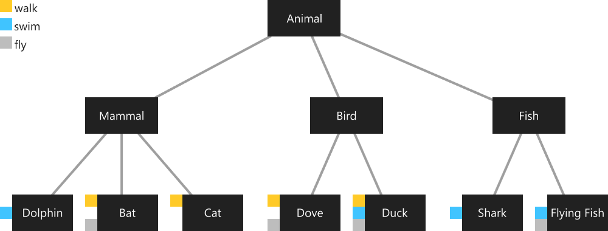

# Dart_Flutter-Summary

---
# Index
- [Dart_Flutter-Summary](#dart_flutter-summary)
- [Index](#index)
- [Dart](#dart)
  - [References](#references)
    - [Articles](#articles)
  - [Dart Fundamentals](#dart-fundamentals)
    - [Keywords](#keywords)
    - [Main](#main)
    - [Comments](#comments)
      - [Single-line comments](#single-line-comments)
      - [Multi-line comments](#multi-line-comments)
      - [Documentation comments](#documentation-comments)
    - [Variables](#variables)
    - [Built in Types](#built-in-types)
      - [Numeros](#numeros)
      - [String](#string)
      - [Booleanos](#booleanos)
      - [List](#list)
        - [Add](#add)
      - [Map](#map)
    - [Control de Flujo](#control-de-flujo)
      - [If](#if)
    - [Funciones](#funciones)
    - [OOP](#oop)
      - [Classes](#classes)
      - [Private Properties](#private-properties)
      - [Setters and Getters](#setters-and-getters)
      - [Abstrac Clases](#abstrac-clases)
      - [Herencia](#herencia)
    - [Mixins](#mixins)
    - [Futures](#futures)
    - [Async y Await](#async-y-await)
    - [JSON](#json)
    - [Error](#error)
  - [Dart Dojo](#dart-dojo)
- [Flutter](#flutter)
  - [References](#references-1)
  - [Flutter Installation](#flutter-installation)
    - [Simulation](#simulation)
  - [Flutter Introduction](#flutter-introduction)
    - [Conceptos Fundamentales en Flutter](#conceptos-fundamentales-en-flutter)
    - [Arbol de Widgets](#arbol-de-widgets)
    - [Estructura de un proyecto en Flutter](#estructura-de-un-proyecto-en-flutter)
  - [Flutter Dojo](#flutter-dojo)


---
---

# Dart


---

## References

* [ ] [Dart Official Documentation](https://dart.dev/guides/language/language-tour)
* [ ] **Fernando Herrera** - Udemy
  * [ ] Flutter - Tu guia Completa de desarrollo para IOS y Android
    * [x] Seccion 1 - Introduccion
    * [x] Seccion 2 - Introduccion a Dart
    * [ ] Seccion 3 - Introduccion a Flutter
      * [x] Temas puntuales de la seccion

### Articles

* [ ] [Mixins Article](https://medium.com/flutter-community/dart-what-are-mixins-3a72344011f3)

---

## Dart Fundamentals

**Principales Caracteristicas de Dart**
* Dart puede compilarse de 2 formas:
  * **AOT**(Ahead Of Time) : Compilado rapido y predecible codigo nativo.(Totalmente personalizable)
  * Puede ser **JIT** (Just In Time): Compilado para una velocidad excepcional de desarrollo. (Esto incluye el Hot Reload)
* Dart le permite a Flutter hacer facil la creacion de animaciones y transiciones que corren a 60fps (frames per second)
* Al ser compilado a codigo nativo, no hay puentes innecesarios para correr el codigo. Estamos haciendo aplicaciones nativas en eso dispositivos.
* Dart le permite a Flutter evitar el desarrollo de diseños en archivos independientes como JSX, XML o bien interfaces separadas.
* Dart es relativamente facil de aprender.

### Keywords

* 

### Main
Estructura inicial para Dart
* `main` le dice a Dart cual es la entrada para la ejecucion principal de su programa.  
```dart
void main(){
  // Punto Inicial
  print("Hola Mundo!!!");
}
```

* Tambien puede funcionar de forma *Dinamica*.
* Everything you can place in a variable is an object, and every object is an instance of a class.
  * Even numbers, functions, and null are objects. 
  * All objects inherit from the Object class.
* Dart is **strongly typed**, type annotations are optional because Dart can infer types.
  * Dart es un lenguaje **Tipado**, o sea que sus variables son tipadas. 
  * When you want to explicitly say that no type is expected, use the special type dynamic.
* Dart supports **generic types**, like ``List<int>`` (a list of integers) or ``List<dynamic>`` (a list of objects of any type).
* Unlike Java, Dart doesn’t have the keywords public, protected, and private. If an identifier starts with an underscore (_), it’s private to its library. 
  * For details, see [Libraries and visibility](https://dart.dev/guides/language/language-tour#libraries-and-visibility).
* In Dart is mandatory end each line of code with `;`.

### Comments

* Dart supports:
  * **single-line comments**
  * **multi-line comments**
  * **documentation comments**

#### Single-line comments

* A single-line comment begins with ``//``. 
* Everything between ``//`` and the end of line is ignored by the Dart compiler.
* Example:
  ```dart
  print("Hello world"); // comment
  ```

#### Multi-line comments

* A multi-line comment begins with ``/*`` and ends with ``*/``.
* Everything between ``/*`` and ``*/`` is ignored by the Dart compiler (unless the comment is a documentation comment; see the next section). 
* Multi-line comments can nest.
* Example:
  ```dart
  void main() {
    /*
    Block 
    of 
    comment
    */
  }
  ```

#### Documentation comments

* Documentation comments are multi-line or single-line comments that begin with ``///`` or ``/**``. 
* Using ``///`` on consecutive lines has the same effect as a multi-line doc comment.
* Inside a documentation comment, the Dart compiler ignores all text unless it is enclosed in brackets.
* Using brackets, you can refer to classes, methods, fields, top-level variables, functions, and parameters.
* The names in brackets are resolved in the lexical scope of the documented program element.
* Example: documentation comments with references to other classes and arguments.
  ```dart
  /// A domesticated South American camelid (Lama glama).
  ///
  /// Andean cultures have used llamas as meat and pack
  /// animals since pre-Hispanic times.
  class Llama {
    String name;

    /// Feeds your llama [Food].
    ///
    /// The typical llama eats one bale of hay per week.
    void feed(Food food) {
      // ...
    }

    /// Exercises your llama with an [activity] for
    /// [timeLimit] minutes.
    void exercise(Activity activity, int timeLimit) {
      // ...
    }
  }
  ```
  * In the generated documentation, [Food] becomes a link to the API docs for the Food class.
* To parse Dart code and generate HTML documentation, you can use the SDK’s [documentation generation tool](https://github.com/dart-lang/dartdoc#dartdoc).
* [Effective Documentation](https://dart.dev/guides/language/effective-dart/documentation)

### Variables

* Declare a variable
  ```dart
  // Dynamic variable - Dart Infiere el tipo de dato con el valor asignado.
  var name_variable = <some_value>;

  // Typed Variable
  <type> name_varaible = <some_value>;
  ```

### Built in Types

#### Numeros

* `int`
* `double`

#### String

* `String`
* You can concatenate
  ```dart
  'Hello $varible_1 $variable_2';
  // or for compound varaibles names, use { and }. Like JS
  'Hello ${obj.variable_1}';
  ```

#### Booleanos

* `bool` puede ser `true` or `false`.

#### List

* La Lista es una coleccion de objetos/informacion que tienen algo en comun.
* Declaracion
  ```dart
  // Dynamic List
  List name_list = [ value_1 , value_2, ...];

  // Typed List
  List<type> name_list = [ value_1 , value_2, ...];

  // Fixed Size
  List name_list = new List( number_size );
  ```
##### Add

* Add, add an element in the last place
  ```dart
  name_list.add();
  ```

#### Map

* Object that contains Key/Value pairs.
* Also known like Dictionary.
* Declared
  ```dart
  // Dynamic Map
  Map name_map = {
    key_1 : value_1,
    key_2 : value_2,
  };

  // Typed Map - can be = dynamic
  Map<type_key, type_value> name_map = {
    key_1 : value_1,
    key_2 : value_2,
  };
  ```
* Call
  ```dart
  name_map['key_1'];
  ```


### Control de Flujo

#### If

* If
  ```dart
  if(){
    // code
  }else{
    // code
  }
  ```


### Funciones

* Function's declaration:
  ```dart
  // Classic declaration. Positional Parameters
  type name_function( type param_1 = optional_value, ...) {
    // code
    return some_value;
  }

  // Name Arguments. Parameters with names. Not Positional Parameters
  type name_function( {type name_x, ...} ) {
    // code
    return some_value;
  }

  // Arrow functions
  type name_function( {type name_x, ...}) => some_value_to_return;
  ```
* Function's call
  ```dart
  // Classic call
  name_fucntion( arg_1...);

  // Parameters with name. Doesn't import the order of the parameters
  name_fucntion( name_x : arg_value_x, ...);
  ```

### OOP

#### Classes
* Declared
  ```dart
  class ClassName {
    // Properties
    type propertie_1;
    type propertie_2;

    // Constructor
    ClassName(type prop_1, ...){
      this.propertie_1 = prop_1;
      // ...
    }

    type method_1( type param_1, ...){
      // code
      return type_something;
    }
  } 
  ```
  * Optional constrcutor definition. In a short way.
  ```dart
  class ClassName {
    // Properties
    type propertie_1;
    type propertie_2;

    // Constructor
    ClassName({this.prop_1, ...}){

    }
  ```
  * `this` is optional inside the Class.
  * You can use Arrow function to declare methods.
  * Named Constrcutor
  ```dart
  class ClassName {
    // Properties
    type propertie_1;
    type propertie_2;

    // Constructor with Name
    ClassName.nameMethod({this.prop_1, ...}){

    }
  ```


* Instance
  ```dart
  final obj_1 = new ClassName();
  // or without new keyword
  final obj_1 = ClassName();
  ```
* Access to Properties
  ```dart
  obj_1.propertie_1;
  obj_1.method_1( type param_1, ...);
  ```

 #### Private Properties
* Private porterties only are visible inside the class.
* Every property defined starting que underscore `_`, is private.
```dart
  class NameClass {
    type _propertiePrivate;
  }
```

#### Setters and Getters
* Declared settes and getters
  ```dart
  class NameClass{
    type _propPrivate;

    void set prop( type value_1, ...){
      this._propPrivate = value_1;
      // code...
    }

    type get prop{
      return _propPrivate;
    }
  }
  ```
* To use them:
  ```dart
  NameClass obj = new NameClass(...);

  // Set
  obj.prop = some_value;

  // Get
  dynamic some_variable = obj.prop;
  ```

#### Abstrac Clases

* How to declare Abstract classes
  ```dart
  abstract class NameAbstractClass{

  }
  ```
* Abstract Classes can't be created with a `new` expression.
* Las clases abstractas nos permiten obligar a otras clases a implementarse/declararse/definirse siguiendo estrictamente algunas especificaciones hechas en las clases abstractas.
* Cumplir con propiedas y metodos especificos.
* Sirve de lineamiento.
* Como implementar/usar las clases abstractas, usar `implements`:
  ```dart
  class AnotherClass implements NameAbstractClass{
    // code: Need to implement at least the properties
    //  and methods of the Abstract Class.
  }
  ```

#### Herencia

* Para hacer uso de herencia `extends`:
  ```dart
  class FatherClass{
    // code
  }

  class ChildClass extends FatherClass{
    // code
  }
  
  ```
* Es comun que las clases padres no sirvan para instanciar, solo para heredar. Entonces se suele hacerlas abstractas a las clases.

### Mixins

* Es la forma de darle solo ciertas partes de otras clases a una clase.
* Se logra con la palabra `with`.
* Example:
  
  * Code:
  ```dart
  abstract class Animal{
    // code
  }

  abstract class Mamifero extends Animal{
    // code
  }

  abstract class Aves extends Animal{
    // code
  }

  abstract class Peces extends Animal{
    // code
  }

  // -----------
  abstract class Volador{
    void volar() => 'volar';
  }
  abstract class Nadador{
    void nadar() => 'nadar';
  }
  abstract class Caminante{
    void caminar() => 'caminar';
  }

  // -----------
  // Add the properties of Nadador
  class Delfin extends Mamifero with Nadador{
    // code
  }
  class Murcielago extends Mamifero with Caminante,Volador{
    // code
  }
  class Gato extends Mamifero with Caminante{
    // code
  }
  class Paloma extends Aves with Caminante, Volador{
    // code
  }
  class Pato extends Aves with Caminante, Volador, Nadador{
    // code
  }

  ```

### Futures

* Imprecidinble cuando hay tareas asincronas.
* Son exactamente lo mismo en lo que se conoce en JS como *Promesas*.
* Un **Future** es una tarea asincrona que se desarrolla en un hilo independiente.
* How declare a Future
  ```dart
  Future
  ```
* How consume a Future
  ```dart
  somethingReturnFuture()
    .then( (data) {
      // code
    })
    .catch( (err) {
      // code
    });
  ```


### Async y Await

* **Async** ayuda a transformar una funcion en una Promesa/Future.
* **Await** permite esperar hasta que se resuelva la Promesa/Future.
* Para usar *Await*, debe de estar si o si dentro de una funcion *Async*.
* Example:
  ```dart
  void nameFunction() async {
    final variable = await someAsyncTask();
    // code...
  }
  ```
* No se puede hacer constructores asincronos.


### JSON

* Import a library to work with JSON
  ```dart
  import 'dart:convert';

  // Parse a Json. Convert a Json in to an object.
  Map json_obj = json.decode( JSON_var );
  ```

### Error

* Throw
  ```dart
  throw(<msg of error>);
  ```


---

## Dart Dojo


---
---

# Flutter

---

## References


* [ ] [**Flutter Official Documentation**](https://flutter.dev/)
* [ ] **Fernando Herrera** - Udemy
  * [ ] Flutter - Tu guia Completa de desarrollo para IOS y Android
    * [x] Seccion 1 - Introduccion
    * [x] Seccion 2 - Introduccion a Dart
    * [ ] Seccion 3 - Introduccion a Flutter
      * [x] Temas puntuales de la seccion
de las clases

---

## Flutter Installation

* 

### Simulation

* 

--- 

## Flutter Introduction

* 
### Conceptos Fundamentales en Flutter

*

### Arbol de Widgets

*

### Estructura de un proyecto en Flutter

*


---

## Flutter Dojo

